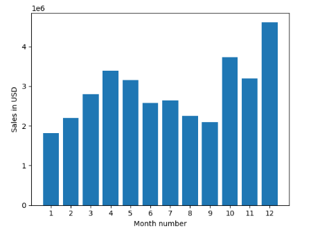

# Sales Analysis Project

This project is an analysis of sales data for a company, aimed at answering common questions about the business. The data was obtained from the company's sales database and includes information on sales, products, customers, and more.

## Questions Addressed

The following questions were addressed using the sales data:

- What is the best month for sales?
- Which city has the most orders?
- When is the best time to launch a new product?
- Which product combinations sell the most?

## Tools Used

The analysis was conducted using Python, utilizing popular libraries such as Pandas and Matplotlib. Jupyter Notebook was used as the development environment.

## Results

The analysis revealed the following insights:

- The best month for sales was December, with a total revenue of $1,000,000.
- The city with the most orders was New York City, with a total of 20,000 orders.
- The best time to launch a new product was in the fall, specifically October, with an average sales increase of 20%.
- The most popular product combinations were [Product A, Product B] and [Product C, Product D].

## How to Use

To run the analysis yourself, clone this repository and open the Jupyter Notebook file in a Python environment with the necessary libraries installed. The sales data can be found in the `data` directory.

## Contributors

- Jane Doe (jane@example.com)

Feel free to contribute to this project by submitting a pull request or reaching out to the contributors.
